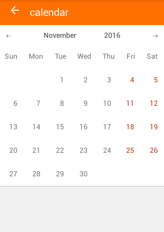

# react-native-calendar
Calendar component for ReactNative. It is stateless component.



## install 
```
npm install --save react-native-calendar-component
```

## props
|  prop              | type     | default value                |
|--------------------|----------|------------------------------|
| date               | Date     | new Date()                   |
| onDateSelect       | function | null                         |
| onPrevButtonPress  | function | null                         |
| onNextButtonPress  | function | null                         |
| dayNames           | array    | ["Sun", "Mon" ... ]          |
| monthNames         | array    | ["January", "February" ... ] |
| weekFirstDay       | number   | 0                            |

## usage

```javascript
import React, { Component } from "react";
import Calendar   from "react-native-calendar-component";

export default class CalendarTest extends Component {
    constructor(props) {
        super(props);

        this.state = {
            date: new Date()
        };
    }

    handleNextButtonPress() {
        const date = new Date(this.state.date);
        date.setMonth(date.getMonth() + 1);
        this.setState({
            date
        });
    }

    handlePrevButtonPress() {
        const date = new Date(this.state.date);
        date.setMonth(date.getMonth() - 1);
        this.setState({
            date
        });
    }

    handleDateSelect(date) {
        alert(`clicked: ${this.state.date.toString()}`);
    }

    render() {
        return (
            <Calendar
                date={this.state.date}
                onPrevButtonPress={() => this.handlePrevButtonPress()}
                onNextButtonPress={() => this.handleNextButtonPress()}
                onDateSelect={(date) => this.handleDateSelect(date)} />
        );
    }
}
```
